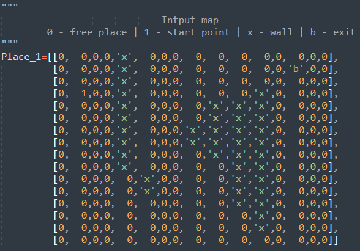
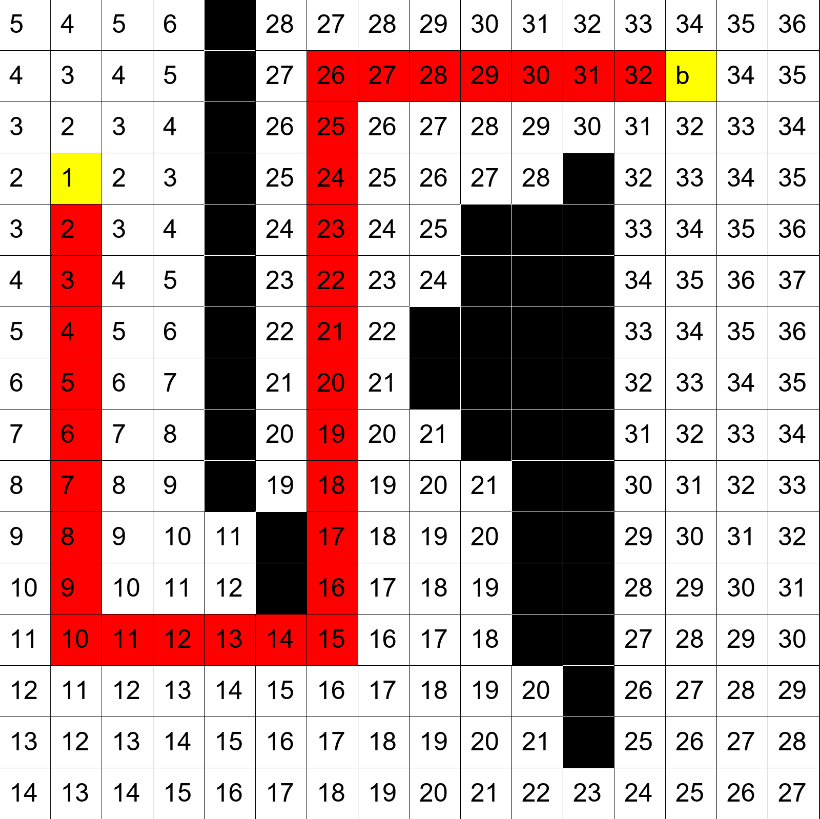

<!--StartFragment-->

The  Lee algorithm is one possible solution for maze routing problems based on breadth-first search

<!--EndFragment-->

# Input
Input is a maze looks like this 

# Output
Output is PNG image looks like this 

In the input image, the start and end points are marked in yellow, and the path points are marked in red.
